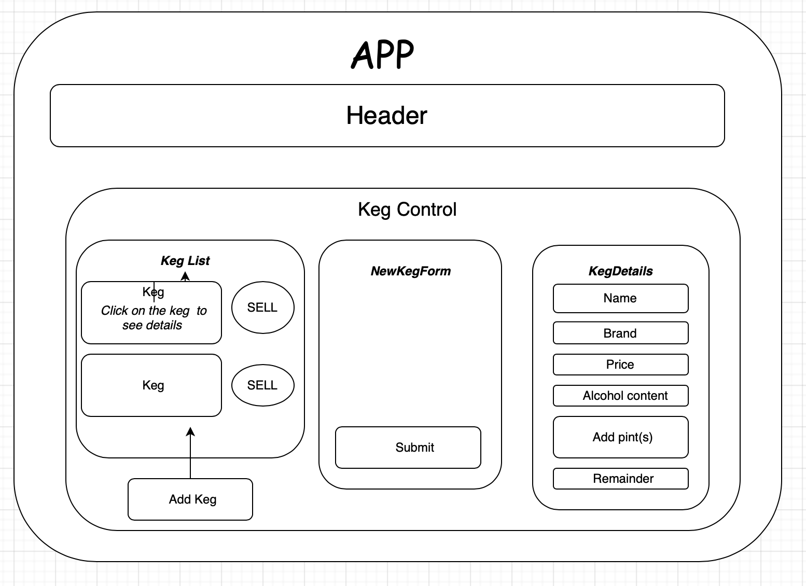

## 
Tap Room 

#### 
📚 *Epicodus Independent Project # 13  (Week 2 of React)  4/26-30/2021* 
 

***
By Daniel Adeyemi***
   

 

## 
 🚩 *Description*:
    

***A React app to track kegs of beer in the beer place***

## 
 📝 Component diagram

Click here to view diagram

## 
 🔧 *Setup/Installation instructions:*
**To run this project locally you will need node.js and Code Editor *(like VS Code)***

 🌐 From the web:

* Go to my GitHub repository, using following [URL](https://github.com/DanielAdeyemi/tap_room.git).
* At the top of the repository, click  then select "Download ZIP".

* Unzip the file, navigate to the `src` directory to check code

 ⚙️ From the terminal:
 

* Clone my repository from GitHub using `git clone https://github.com/DanielAdeyemi/tap_room.git` in your terminal or GitBash
* Navigate to the downloaded folder using ***cd*** command
* Execute **code .** command in your terminal and it will open all source code in your code editor.  

## 
 🧰 *Setup Options:*   

`npm install`   
This will insure you have all necessary files to run the program   

`npm start`   
Runs the app in the development mode.    
Open http://localhost:3000 to view in a browser   
Page will reload automatically when you save your changes   

`npm run build`   
Builds the app for production to the *build* folder   
It correctly bundles React in production mode and optimizes the build for the best performance.   
The build is minified and the filenames include the hashes.

⚠️ *Note: make sure you are inside tap_room directory*

## 
 🛠️ *Technologies used:*
* React
* JSX
* JavaScript ES6

## 
 🐛 *Known bugs:*
No known bugs at the moment. Application doesn't have any style and was built to demonsrate understanding of React fundamentals
## 
 🌟 *Improvement opportunities:*
* add style
* implement full CRUD functionality

##  
 📬 Contact Information
#### For any questions *[email author](mailto:adeyemidany+github@gmail.com?subject=[GitHub])*

## 
 📘 *License and copyright:*

> ***© Daniel Adeyemi, 2021***  
> ⚖️ **